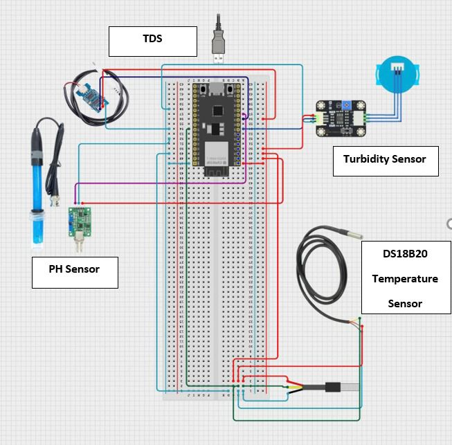
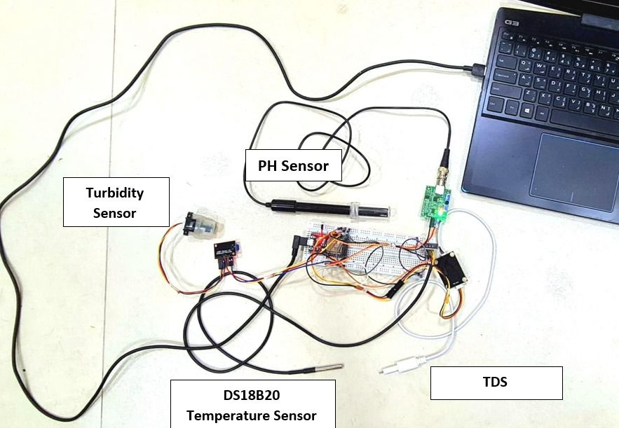
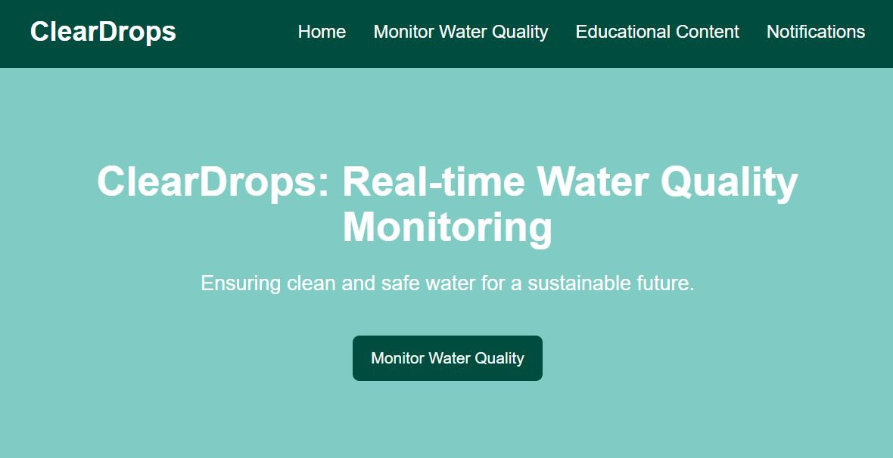
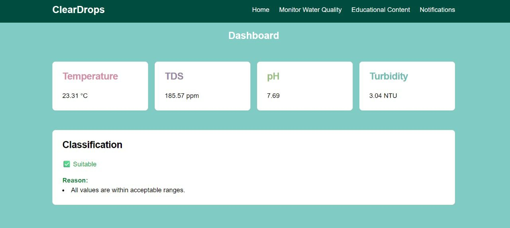
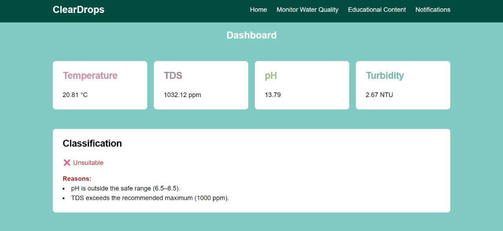
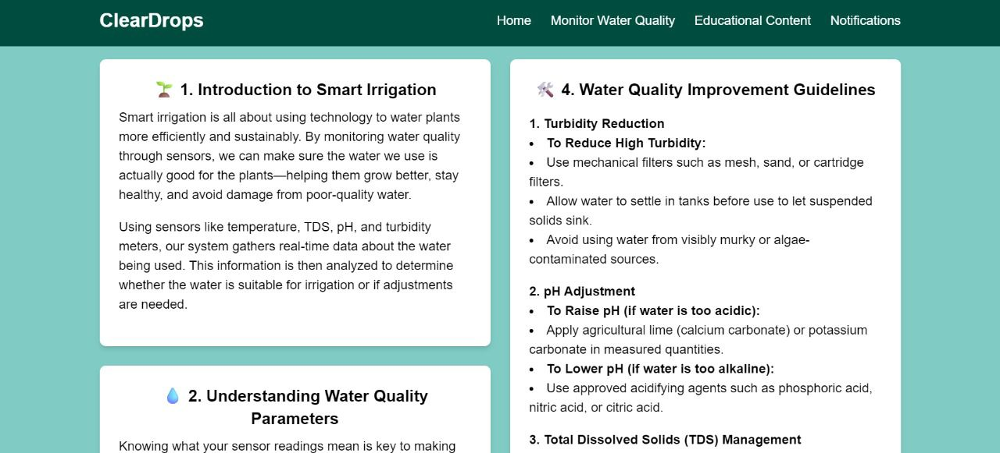

# Smart Water Quality Monitoring System for Reusing AC Water in Agriculture

This project presents an integrated IoT and AI-based system designed to reuse air conditioner (AC) condensate water for agricultural irrigation. It combines hardware sensors, a machine learning model, and a web interface to analyze water quality and provide real-time insights.

## Problem Statement

In hot climates like Saudi Arabia, AC units produce significant amounts of clean condensate water that is usually wasted. Our project aims to repurpose this water as a sustainable resource for agriculture by evaluating its quality and providing usage recommendations.

## Technologies & Tools Used

- **ESP32** microcontroller  
- **Sensors**: pH, TDS, Turbidity, Temperature  
- **Python**, **Flask** for backend server  
- **SVM Model** for classification  
- **Firebase** for real-time database  
- **HTML / CSS / PHP** for web dashboard  
- **Arduino IDE**, **Jupyter Notebook**  
- **Render.com** for hosting Flask app

## System Workflow

1. ESP32 collects real-time data from sensors.  
2. Sends data to Flask server via HTTP POST.  
3. Server classifies data using a trained SVM model.  
4. Results are saved in Firebase Realtime Database.  
5. Web dashboard displays live water quality status.  
6. Alerts are triggered if water is unsuitable for irrigation.

## 📊 Dataset & Model Performance

- Over 5900 labeled samples.  
- Achieved **98.7% classification accuracy**.  
- Used stratified k-fold cross-validation for evaluation.

## 🌱 Benefits

- Promotes water conservation and sustainability  
- Supports the Green Saudi Initiative (Vision 2030)  
- Reduces irrigation costs and freshwater usage

## 📁 Project Structure

ArduinoCloudSketch/
FirebaseSourceCode/
GitHubRepo/
ML_models/
README.md

## 📸 Project Images

### Hardware Setup

### Web Dashboard

## 📦 How to Run

1. Upload Arduino sketch to ESP32  
2. Host Flask server locally or via Render  
3. Connect to Firebase  
4. Access web dashboard

## 👩‍💻 Contributors

- Ghzayel Alhajri  
- Donia Alzahrani  
- Noura Almarri  
- Rawan Alomair

## 📜 License

This project is for academic and educational purposes only.